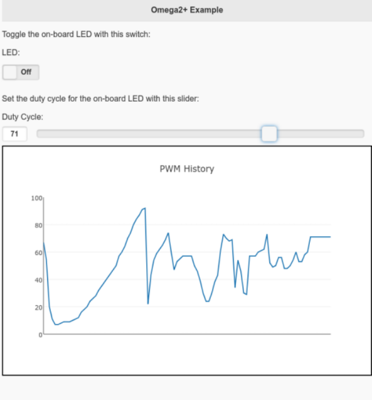

# Introduction

A simple web based application for controlling the Omega2+'s on-board LED over a local network. The user can control the state and PWM duty cycle of the LED.



The application uses [jQuery](https://jquery.com/) for the front-end user interface and Python's [bottle](https://bottlepy.org/docs/dev/) as the web-framework. It is designed to provide a simple template which can built upon to create larger IOT projects.

# Installation

This application has the following dependencies, each can be installed through ssh, directly onto the Omega2+.

- Python3:

```
opkg update
opkg install python3-light
opkg install python3-pip
```

- Bottle:

```
pip3 install bottle
```

- Git
```
opkg update
opkg install git git-http
```

Further instructions on installing these packages can be found [here](https://docs.onion.io/omega2-docs/)

Once the dependencies are installed, this repository can be cloned directly onto the Omegle2+

```
git clone https://github.com/stuianna/omega2_helloWeb.git
```

Finished.

# Usage

Change into to newly cloned directory.

```
cd omega2_helloWeb
```

Start the bottle server:
```
python3 app.py
```

The server takes a few seconds to start-up.

Open up a web browser on another device and navigate to:
```
XXX.XXX.X.X:5000
```
Where the Xs are the IP address of your Omegle2+.

The browser should now be displaying the same screen as the preview image and you can control the Omega2+'s on-board LED.

